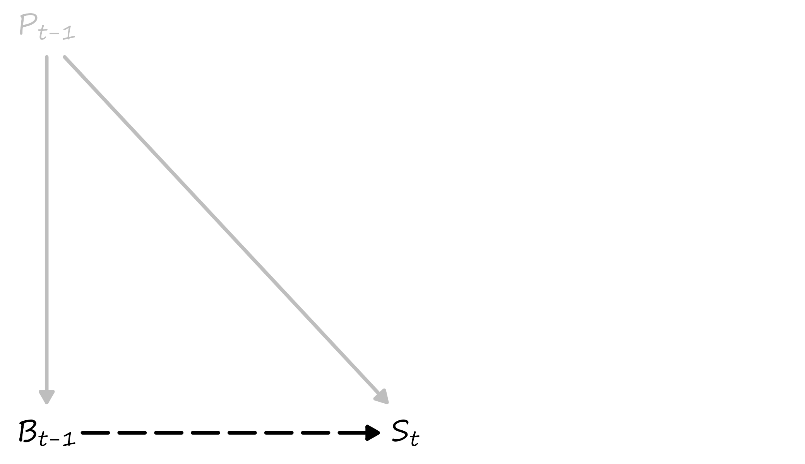
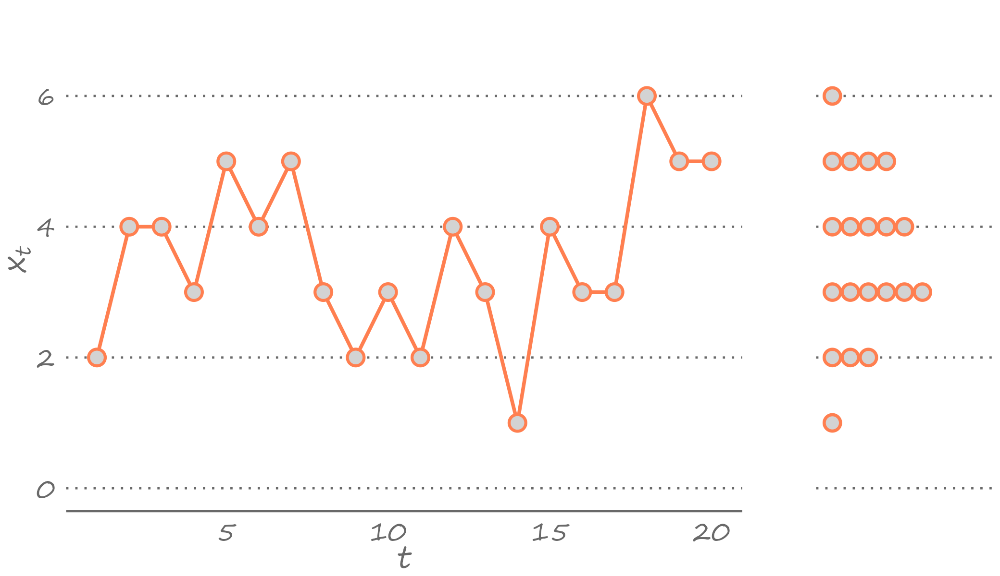
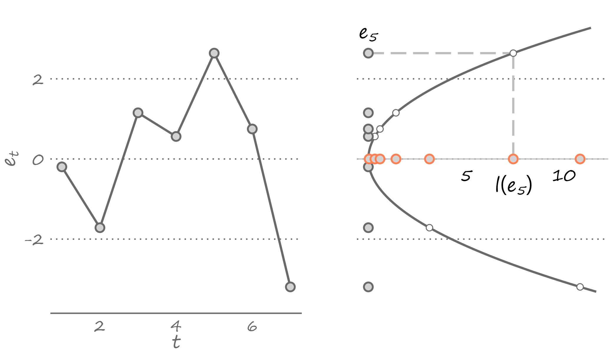
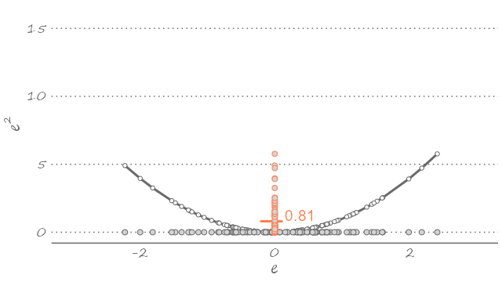

# Forecasting With Time Series Models {-}

# &ndash; Introduction to Forecasting


```{r echo=FALSE, include=FALSE, message=FALSE}
library(ggplot2)
library(data.table)
library(ggthemes)
library(extrafont)
# font_import()
loadfonts(device="win",quiet=T)
library(cowplot)

theme_eg <- function(base_size=12,base_family="Segoe Print",border=F){
  theme(
    panel.background=element_rect(fill="white",color=NA),
    panel.grid=element_line(colour=NULL,linetype=3),
    panel.grid.major=element_line(colour="dimgray"),
    panel.grid.major.x=element_blank(),
    panel.grid.minor=element_blank(),
    plot.background=element_rect(fill="white",color=NA),
    plot.title=element_text(family=base_family,size=rel(1.2),colour="dimgray"),
    plot.caption=element_text(family=base_family,colour="darkgray"),
    plot.margin=margin(.25,.25,.25,.25,"lines"),
    axis.title=element_text(family=base_family,face="bold",size=rel(1.3),colour="dimgray"),
    axis.text=element_text(family=base_family,size=rel(1.1),colour="dimgray",margin=margin(t=1,r=1,b=1,l=1)),
    axis.line=element_line(colour="dimgray"),
    axis.line.y=element_blank(),
    axis.ticks=element_blank(),
    legend.background=element_rect(fill="transparent",color=NA),
    legend.position="none",
    legend.title=element_blank(),
    legend.text=element_text(family=base_family,size=rel(1.1),colour="dimgray"),
    legend.key.size=unit(.75,'lines'),
    strip.background=element_blank(),
    strip.text=element_text(family=base_family,size=rel(0.9),colour="dimgray",face="bold",margin=margin(.5,0,.5,0,"lines"))
  )
}
```

## What Forecast Is and Is Not

What is a forecast if not a guess? An educated guess, nonetheless. We guess because we have no precise knowledge of how things will turn up in the future---near or distant. We may guess today whether it will rain tomorrow, for example. It may or may not rain tomorrow. With each of these two outcomes having some chance of occurring---assuming that we live in a place that can get rain on any day of the year---our claim about whether it will rain is a guess. 

We guess events that are uncertain. These are events for which several outcomes---each with some chance of appearing---are possible. In other words, we guess random variables. Making a claim about whether it will rain tomorrow is a guess because rain is a random variable. In its simplest form, we can think of a rain as a discrete random variable---a binary random variable, to be precise---it either rains or it does not rain. 
More accurately, we can think of a rain as a continuous random variable, albeit truncated from below at zero. So, it either rains or it does not rain. But if it rains, it may rain a little, or it may rain a lot. These all are guesses. By contrast, making a claim about whether the sun will rise tomorrow is hardly a guess. We know with absolute precision when will the sun rise. There is no prophecy about predicting the sunrise. 

A forecast is a guess, but a guess is not necessarily a forecast. A guess that relies on some knowledge or understanding of the underlying causes of an event is a forecast. When commercial banks, or professional forecasters, guess whether the central bank will increase or decrease the nominal interest rates by some fraction of percentage points, they forecast because they base their guess on their understanding of the markets as well as on their understanding of how the central bank reacts to changes in the markets.

Otherwise, an uninformed guess is merely a gamble. Consider, for example, the so-called "card counting." A casino is a gambling house where everyone is welcome so long as gambling is what they do. But when one attempts to "beat the house" using the knowledge accumulated by counting cards, the gamble becomes an educated guess and the gambler becomes *persona non grata*. 

Thus, making a guess that it will rain tomorrow may be a forecast or a gamble. It is a forecast if we make a claim it will rain tomorrow because we looked out of the window and saw clouds today. Such a guess relies on our understanding of meteorological phenomena. It would be a gamble had we made the very same claim based on a hunch, without looking out of the window. 


## A Brief History of the Study of Forecasting

The roots of forecasting extend very much to the beginning of human history. In their desire to predict the future, people have attempted to make forecasts of their own or have used the services of others. This desire to guess what was to come, has been necessitated by the potential benefits such information could offer. 

For many centuries, much of forecasting revolved around weather forecasting. Primarily because weather was the single most important factor that impacted the livelihood of people, and indeed the fate of civilizations. A sequence of droughts toward the end of the ninth century, through its intrinsic links with agriculture, is believed to have led to the collapse of the Classic Mayan civilization [@hodell1995].

Early attempts at weather forecasting were rather simplistic. The Babylonians based their weather forecasts on the appearance of clouds. The ancient Egyptians measured the levels of the Nile River's waters to predict an approaching famine due to droughts or destructive floods. 

Over time, advancements in physics and related fields, and the invention of measuring instruments such as the barometer and the thermometer, contributed to the development of the study of meteorology, the way we know it. The birth of the modern weather forecast is attributed to the invention of the telegraph, however. The telegraph made it possible for the weather forecast to travel sooner than the weather itself and thus made the weather forecast relevant. 

Much like a better understanding of the laws of physics enabled meteorological research, the development of the study of econometrics helped develop the methods and practices of economic forecasting. Irving Fisher, one of the most influential economists of all times and the first generation econometrician---indeed, a founding member and the first president of the Econometric Society---was one of the first academic economists who contributed to the study of economic forecasting through his "Equation of Exchange," which he used as the foundation to forecast prices, albeit with varying success. 

Other notorious economic forecasters of that age, albeit not as known or celebrated academics as Fisher, were Charles Bullock and Warren Persons, who ran a Harvard-affiliated quasi-academic center for business cycle research with main purpose to generate economic forecasts based on historical precedents. Unlike Fisher's forecasts that were model-based, Bullock and Persons' forecasts were more data-driven. These and other "America's first economic forecasters" were primarily focused on predicting stock prices. Their initial success quickly faded with the failure to predict the Great Depression, which plummeted their reputation as forecasters and, with that, their own fortunes as well [@friedman2013].

Much of the success of the early economic forecasters came during the early years of the 20th century. The failure to predict the Great Depression adversely impacted their reputation and, indeed, fortunes. As with the telegraph back in the 19th century, the evolution of the computing power in the second half of the 20th century facilitated the resurrection of economic forecasting, which became increasingly based on the effective use of econometric methods. Toward the end of the 20th century, and particularly from the beginning of the 21st century, the evolution of the Internet and the ease and affordability of computing power allowed the storage and distribution of high-frequency granular data that has further aided the advancement of the study of forecasting. 


## Through the Lens of Causal Inference

Forecasting relies on some understanding of cause and effect between two variables over two time periods, even if one is not intrinsically aware of such a relationship. Such an understanding was apparent in the Babylonians' and Egyptians' methods of weather forecasting. 

Birds' behavior, historically, has been the single most reliable predictor of upcoming changes to the weather. As the adage goes, "*Hawks flying high means a clear sky. When they fly low, prepare for a blow.*" The most likely reason for birds flying low is the sudden change in atmospheric pressure leading to the storm. Birds are "nature's barometers" of the sort. 

We know it now, but our predecessors did not know it back when the barometer was yet to be invented. And yet, it turns out that their basing of the weather forecast on birds' behavior was not unfounded. 

Birds do not cause storms; changes to air pressure do. But both the birds' behavior and the storm are the outcomes of the same cause---atmospheric pressure. As it happens, one outcome (birds' behavior) precedes the other outcome (the storm). And such temporal ordering of the events---each an outcome of an exogenous shock---helps build a simple forecasting model, which is based on a mere correlation, and yet it works. Consider the following diagram.

```{r birds, fig.cap="Causality, Correlation, and Forecasting"}

```

On this diagram, **P** denotes air pressure, **B** denotes birds' behavior, and **S** denotes a storm. The subscripts clarify temporal ordering. The solid lines indicate a causal relationship, and the dashed line indicates a correlation without causality. The gray lines indicate an unobserved effect, and the black line indicates the observed effect. Based on this diagram, while we do not observe the true causal effect, the observed correlation and the temporal ordering of the two outcomes of the same cause helps us build a useful predictive model. Of course, had we observed the true causal effects, the relationship between air pressure and birds' behavior would deem obsolete. 

This illustration alludes to a notable feature of forecasting. To make a forecast, one does not need a "clean" identification of the causal mechanism. A mere correlation might as well suffice. In some instances, this might even be a preferred setting. Correlation captures information on unobserved variables, which aids in forecasting, whereas causal inference specifically ignores this information. 

That's not to say that forecasting does not rely on causal relations. It does, very much so. And everything else held constant, the causal relationship would be preferred to the correlational. In our example, once the scientifically substantiated causal linkage between changes in atmospheric pressure and the occurrence of storms was established, there was little need and hardly any value in the correlational relationship between birds' behavior and the occurrence of storms.


## Self Fulfilling Prophecy

The foregoing illustration paints an uncharacteristically simplistic picture of forecasting. It describes a rather simplified model as it omits several factors, other than air pressure, that could influence birds’ behavior or the formation of a storm. It also illustrates a relatively straightforward forecasting exercise because it involves relations between climate and nature. Such relationship is closer to a hard science than to a soft science. 

Things become increasingly more complex and much less predictable when people, with their behavioral peculiarities, enter the equation. Economists, who obviously deal with systems that involve or are comprised by people, are notorious for making bad forecasts. One of the earliest economic forecasts that did not quite live up to the expectations, was that of Irving Fisher who, in early October of 1929, made the claim that "stock prices have reached what looks like a permanently high plateau." The Wall Street Crash and Great Depression followed shortly after.

Often, we fail to forecast because we cannot know what will happen in the future. But sometimes, we fail to forecast because we exactly know what is to come. The issue lies in our ability to influence the future because we could forecast it reasonably well. 

An extreme case that helps illustrate the point is the concept of efficient markets. Consider a scenario where, through news, we learned that stock prices of a publicly traded company would increase tomorrow. This creates a temporal arbitrage opportunity: we can buy the stock today, when its price is still low, and sell it tomorrow, when its price has increased. 

If we were the only people who became aware of such an opportunity, the scheme would just work. But the information is available to everyone and at once. Thus, many people will learn about this opportunity and act accordingly: They will all try to buy the shares of the company immediately to sell them for the higher price later. This will create demand, and the share prices will increase today instead of tomorrow. And the temporal arbitrage opportunity will be no more.

What we just described is known as the *efficient market hypothesis*. The efficient market hypothesis suggests that markets adjust immediately and correctly to the relevant new information. As a result, traders cannot take advantage of this new information. The moment one realizes there can be an arbitrage opportunity, it is already too late. So, some things, such as stock prices, are unpredictable but not because we don't know what will happen to them. *Au contraire*, it is because we know this all too well. 


## Knowing the Unknown

Methods of forecasting may differ, but they have one thing in common: they all rely---or at least pretend to rely---upon information. We record and observe information in the form of *data*. When the data are organized and stored in a certain way---chronologically and at regular intervals---we have a *time series*. By construction, a time series is historical data. Forecasting involves examining historical data to make an informed guess about what is to come in the near or the distant future. 

```{r time-series-c1, fig.cap="A time series and its density"}

```

The left-hand side of the graph features a time series of 20 observations, given by $x_t$, where $t=1,\ldots,20$. The observation in the first period, $x_1$, takes the value of two; the observation in the second period, $x_2$, takes the value of four; and so forth until the observation in the last period, $x_{20}$, which takes the value of five.  

The question is, given the observed data, what would be our best guess about $x_{21}$, that is, the value of the observation in the subsequent period? In other words, the question asks us to forecast the next observation, given that we have observed the chronological sequence of the previous 20 observations. 

To answer this question, let's summarize what we know. The density of the observed time series, presented in the form of stacked dots on the right-hand side of the figure, does that. Technically, what we illustrate here is the probability mass rather than the probability density. We can see that the observed values range from one to six, and some of them appear more frequently than others. Specifically, *three* appears most frequently in our observed sample. So, our best guess can be *three*. 

But we can also give another answer. We can see that the most recently observed value is five. And if we suspect some temporal dependence in the time series---that is, if we believe there is some positive correlation between back--to--back observations---then our guess may be tilted toward five. So, in this instance, our best guess could be *four*. 

The foregoing illustration alludes to an important clarifier of a forecast. A forecast is a bunch of outcomes or values, each with some probability of occurring. If a variable of interest is continuous, then a forecast is a density. More specifically, a forecast is a conditional density, which depends on the available information at the time when the forecast is made, and it combines everything we know or do not know about the unknown.^[In words of the former U.S. Secretary of Defense, Donald Rumsfeld "*As we know, there are known knowns; there are things we know we know. We also know there are known unknowns; that is to say we know there are some things we do not know. But there are also unknown unknowns--the ones we don't know we don't know.*"]

We rarely use a density to communicate our forecast, however. When commercial banks or professional forecasters make a guess about the upcoming interest rate hike by the central bank, they usually report a single value. That is a *point forecast*---the simplest and most frequently used summary of a forecast. A point forecast is one value that qualifies or quantifies our guess about the future realization of an event, for example, a guess that it will rain tomorrow or a that the central bank will increase interest rates by 0.25 percentage points. In our illustration, the guess that in period 21 we could observe *three* is a point forecast. 

We denote point forecast by $\hat{y}_{t+h|t}$, where $h$ is the forecast horizon. We use "hat" to emphasize that a forecast is based on parameter estimates rather than on the true parameters of the model. In other words, $\hat{y}_{t+h|t}$ is an $h$-step-ahead point forecast made in period $t$ based on available data, assumed model, and the estimated parameters of this model. In the foregoing example, where we were attempting to guess the realization of the variable in period $21$ based on information up to and including period $20$, our forecast horizon was one. 


## Why We Can't Get It Right

The difference between a point forecast and the realized future outcome of a variable is the *forecast error*. That is, $$e_{t+h|t} = y_{t+h} - \hat{y}_{t+h|t}.$$

We might commit an error in forecasting for many reasons, and we can consolidate these reasons into three categories. First, we might commit forecast error because of the very essence of the endeavor: we are trying to guess something in the future, which has not happened yet. Many factors contribute to the realization of a variable, including new factors that we do not observe or are unaware of at the time when we make a forecast. All economic forecasts pertaining to federal or state budgets of 2020 were off, by a large margin. At the time when projections were made, probably in the second half of 2019, nobody knew the once--in--a--lifetime global pandemic would derail economies around the world. These are unavoidable forecast errors that present themselves due to lack of information from the future.

Second, we may commit forecast error because the model we choose to generate forecasts is, at best, a close approximation of the true model. In the earlier illustration, the model that our predecessors used to forecast storms was obviously wrong. And although we made the case that it was "sufficiently good,"  the model was far from perfect and certainly not complete. Winds, for example, can direct clouds in another direction, resulting in no storm. And our model, at least the way we presented it, did not account for the wind. We commit such forecast errors because we are not aware of the true model due to our incompetence or ignorance. These are potentially avoidable forecast errors. Indeed, time series econometrics and forecasting evolve in search of true models.

Third, we may commit forecast error because we rely on estimates of the model parameters, rather than on its true parameters. The estimates can be off for many different reasons. They could be off, for example, because of the measurement error in the variables that we apply or because of the sampling error. In any case, the discrepancy between estimated parameters and true parameters could lead to a forecast error.

These three components of a forecast error are the known unknowns. They are pretty much unavoidable in practice. When we get a forecast exactly right, that usually is because the three errors, by fluke, have exactly offset one anther.


## Minimizing the Risk of Getting It Wrong

A point forecast can be any value, any reasonable guess. The *optimal* point forecast is the best guess. That is, the optimal point forecast is a point forecast that minimizes the risk of getting it wrong.

We measure risk using a *loss function*. A loss function, which we denote by $l(e_{t+h|t})$, is a transformation of a forecast error such that the following conditions are satisfied:

i.  $l(e_{t+h|t}) = 0$ for all $e_{t+h|t}=0$;
ii.  $l(e_{t+h|t}) \geq 0$ for all $e_{t+h|t} \neq 0$.


Commonly used functions assume the *absolute* loss, $l(e_{t+h|t}) = \lvert e_{t+h|t}\rvert$, and the *quadratic* loss, $l(e_{t+h|t}) = (e_{t+h|t})^2$. These are symmetric loss functions insofar as a positive error is deemed as bad as a negative error of similar magnitude.^[There are also asymmetric loss functions, which are relevant in instances when it makes sense to "penalize" the forecast error more so in one direction than another.] When symmetry is imposed, the following condition, in addition to the previous two, is also satisfied:

iii.  $l(e_{t+h|t}) \geq l(e_{s+h|s})$ for all $\lvert e_{t+h|t}\rvert \geq \lvert e_{s+h|s}\rvert$.

The quadratic loss is particularly popular, partly because it echoes the way we typically fit the model to the data---i.e., using a least squares estimator. The following figure plots a sample of forecast errors mapped onto the quadratic loss function, represented by the U-shaped curve centered on zero (flipped clockwise for illustration purposes).

```{r loss, fig.cap="Forecast errors and the quadratic loss"}

```

The optimal forecast minimizes the expected loss,
$E[l(e_{t+h|t})]$. Assuming the quadratic loss function:
\begin{equation}
	E[l(e_{t+h|t})] = E(e_{t+h|t}^2) = E[(y_{t+h}-\hat{y}_{t+h|t})^2].
\end{equation}

As it turns out, a point forecast that minimizes the expected loss function is the mean of the random variable:
\begin{equation}
	\hat{y}_{t+h|t} = E\left(y_{t+h}\right).
	(\#eq:optimal)
\end{equation}

This is to say that given what we know about the dynamic properties of a time series, out best guess about its future realization---assuming the quadratic loss---is the weighted sum of its all possible future realizations. The equality in equation \@ref(eq:optimal) is implied in Figure \@ref(fig:loss). If we were to use any value other than the mean---which would imply sliding the U-shaped curve to the left or to the right---the expected value of the loss function will only increase. The following animation presents a visualization of this thought exercise.



In Figure \@ref(fig:time-series-c1) we illustrated a time series and its density over the periods from 1 to 20. Suppose this is all the information we have. Then, we can conclude that *one* and *six* occur with a probability of $0.05$, *two* occurs with a probability of $0.15$, *five* occurs with a probability of $0.20$, *four* occurs with a probability of $0.25$, and *three* occurs with a probability of $0.30$. Using this information, and assuming that the realizations of the observed series are independent of one another, the optimal point forecast, under quadratic loss, will be ${1\times 0.05}+{2\times 0.15}+{3\times 0.30}+{4\times 0.25}+{5\times 0.20}+{6\times 0.05}=3.55$. If we know that the value must be an integer, then we round our forecast to *four*. The actual realization, of course, can be any value, including a value that we have not observed in the data. But our guess of *four* gives us the best chance of being as close as possible to the realized value, given the information that we have and the assumptions that we have made about the model.

## Economists Do It With Models

Model is our simplified vision about how things are interrelated. Whether the things are truly related is irrelevant. Because model is not the truth. Model is our understanding of the truth, which may very well be wrong.^[George Box went so far as to say: "*All models are wrong but some are useful.*" ]

As knowledge accumulates, our understanding of the true relationship between things improves. So, we come up with better models that help us more accurately approximate the truth.


## Getting It Right for the Right Reasons

There may be instances---if we are fortuitous---when our forecast is spot-on. But such an instance will be just that---a fluke. Because our model is a simplified approximation of the truth, we cannot count on getting the forecast exactly right. For the most part, our forecasts will be off, and this is perfectly okay, so long as *on average* we are spot-on.

In fact, we may make an impeccable guess about the future for the wrong reasons. Suppose our "model" is such that it always predicts a recession. Then, every so often, we will get it right. Because recessions happen. But we will be getting it right for the wrong reason. Because our "model" is clearly wrong. Recessions are not the only outcomes of the business cycle.

The time series in the figure above were generated so that each observation was drawn from independent and identically distributed random variables. The presented density then serves as a close approximation of a forecast. Assuming quadratic loss, the optimal forecast would be, as we calculated above, *four*. Had we only observed the very last observation, which is *five*, our best guess for the next observation would have been *five*. If the next observation turned out to be five, then we would have guessed it right for the wrong reason. The right forecast would have been *four*, even if it turned out to be inaccurate.

Even if we are---by luck or serendipity---successful in fully eliminating the fraction of forecast errors that are attributed to model and parameter uncertainties, we are bound to get things wrong most of the time because we do not observe the future. So, there is no use in chasing the perfect forecast. Such a thing cannot exist. Instead, we should search for a model that closely approximates the true data generating process, and to estimate parameters of this model as efficiently as possible. Indeed, these aims have largely motivated the development of time series econometrics.

