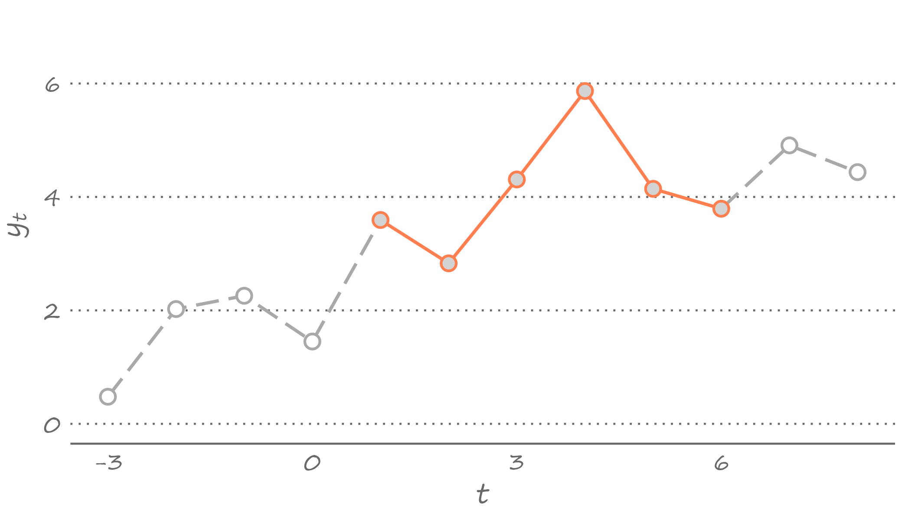
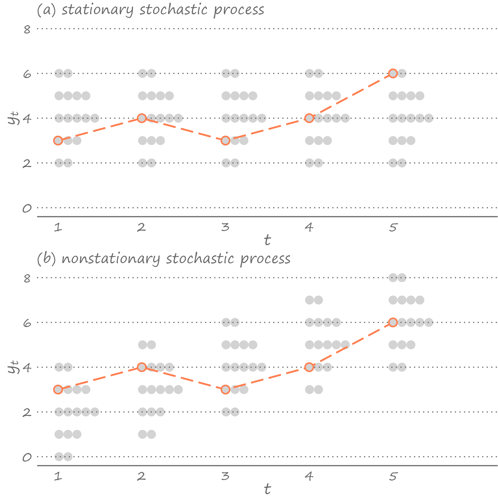
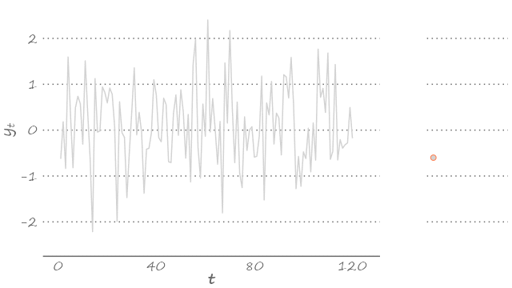

# &ndash; Features of Time Series Data


```{r echo=FALSE, include=FALSE, message=FALSE}
library(ggplot2)
library(data.table)
library(Quandl)
```

## Stochastic Process and Time Series

A time series is a set of data observed at regular intervals and stored in chronological order. Each data point of a time series is a realization of a random variable. A time series is an observed sequence of realizations of chronologically stored random variables. 

Let's unpack the foregoing sentence. What do we mean exactly when we say "observed sequence"? This is a segment of time that covers the starting period and the ending period of the time series. Think of this segment as a history of the observed data as depicted in \@ref(fig:time-series-c2), for example. 
```{r time-series-c2,fig.cap="Observed time series"}

```

The black solid lines and circles indicate an observed part of the series, and the gray dashed lines and circles are a part of the series we do not observe. So, in this illustration, the observed sequence of historical data, or the time series, ranges from period 1 to period 6.\sidenote{It is common to "normalize" the time index so that the first observation is 1, the second observation is 2, etc. Of course, the starting time period need not be normalized to 1, and the temporal increment need not be 1 either.}

We usually have limited access to the past. We certainly have no access to the future. So, an observed time series can only run as far as the present time. And we often do not have access to the part of the history that predates the very first observation of a time series at hand. For example, we cannot have the actual measurements of temperature from times when the thermometer was yet to be invented. We also cannot have data on unemployment rates in post-Soviet countries because, well, tHeRe wAS nO uNeMpLoYmEnt in the USSR.

To formalize, a time series is a finite sample from an underlying doubly--infinite sequence: $\{\ldots,y_{-1},y_{0},y_1,y_2,\ldots,y_T,y_{T+1},\ldots\}$. This is to say that the history extends beyond the starting and ending points of the sample at hand.

These time series is a set of realizations from random variables indexed by time, $\{\ldots,Y_{-1},Y_0,Y_1,\ldots,Y_T,Y_{T+1}\ldots\}$. This sequence of random variables is known as the \textit{stochastic process}. Thus, a time series is a realization of a stochastic process.

Suppose, for example, a stochastic process consists of a set of normally distributed random variables. Each of these random variables has a distribution that we can fully describe by its mean and standard deviation. By definition, in each time period, virtually any value can be the realization of this random variable. But we only observe one value---one realization---and this is all the information we can get about this given random variable in this given time period. 

The November 2022 unemployment rate in the United States was 3.4 percent.\sidenote{Not seasonally adjusted value, from U.S. Bureau of Labor Statistics via FRED, Federal Reserve Bank of St.~Louis online data portal.} In a parallel universe---e.g., if we could re-run the sequence of macroeconomic events that led to this realization---the unemployment rate may have been higher or lower. But we don't have the luxury of observing parallel universes. We don't get to re-write histories. The unemployment rate of 3.4 percent is the only value that will ever be known for this period. The same is true for all the preceding and succeeding periods. In other words, out of infinite possible time series runs that we could have observed, we only observe one such run, and that is the only history that will ever be known to us.


## Stationarity and Ergodicity

The random variables that comprise the stochastic process may or may not have the same distributions. If they have the same distributions, then the stochastic process is \textit{stationary}.\sidenote{Intuitively, a stochastic process is (strictly) stationary if a time shift does not change its statistical properties. More formally, stationary implies that the joint density of $Y_r,\ldots,Y_{r+j}$ is the same as the joint density of $Y_s,\ldots,Y_{s+j}$, for any integers $r \ne s$ and $j$.} Otherwise, the stochastic process is \textit{nonstationary}. 

To get an idea of whether a stochastic process is stationary or nonstationary, we would need to compare the distributions, or joint distributions, of the random variables comprising the stochastic process. This seems to be a straightforward exercise. Except, it also is an infeasible exercise. The gist of the matter is that we never observe the distribution or the density of $Y_t$. Rather, in each period, we only observe its one realization, $y_t$. 

When we observe a time series, we can not be too sure whether these are realizations of a stationary stochastic process or a nonstationary stochastic process. The exact same realizations can come from a stationary process or a nonstationary process, as we can see in Figure \@ref(fig:stochastic). 
```{r stochastic,fig.cap="Stationary and nonstationary series"}

```

Panel (a) illustrates the stationary stochastic process (densities in each time period are identical); panel (b) illustrates the nonstationary stochastic process (densities shift upward over time).\sidenote{This is one of the forms of nonstationary processes in which the mean increases over time but the variance remains constant. Anther variant might have been, for example, if the variance increased over time while the mean remained constant. Indeed, any change in the way densities look would constitute a nonstationary process.} And yet, in both instances, we observe an identical time series. 

That the same observed time series may be a manifestation of a stationary process or a nonstationary process may seem problematic, which it would have been had we only observed a very short time series with only a handful of observations. But in practice, luckily, we usually work with at least several dozen observations, often hundreds or thousands of observations. A long enough time series allows us to infer a lot more from the single realizations of random variables than what would seem to be plausible.	

This is where ergodocity, in conjunction with stationarity, kicks in. Ergodicity implies independence of random variables that are sufficiently far apart from each other in the stochastic process.\sidenote{This is only an intuitive definition of the concept. The formal definition is mathematically tedious.} An important practical benefits of it is that when the process is stationary and ergodic, the moments of the time series converge to the moments of the stochastic process as the sample size increases. So, the mean of the time series will be equal to the mean of the random variables comprising the stochastic process, the variance of the time series will be equal to the variance of the random variables comprising the stochastic process, etc. Ergodicity has the effect of the law of large numbers in time series analysis, in the sense that the distribution of a long enough time series is representative of the distribution of the random variables comprising the underlying stationary stochastic process. 


## White Noise Process

Consider a time series comprising of realizations from independent and identically distributed (iid) normal random variable with zero mean and constant variance: $Y_t \sim iid~\text{N}\left(0,\sigma^2\right)$. Thus, by construction, neither the mean nor the variance of the random variables change with time. Such stochastic process is referred to as a \textit{White Noise} process.\sidenote{Technically, this is a \textit{Gaussian} white noise process as the random variables are iid \textit{normal}. Without the assumption of normality we would have an \textit{Independent} white noise process. Without the assumption of independence we would have a white noise process.} That is, an ordered sequence of random variables indexed by $t$, $\{Y_t\}$, is a white noise process if for all time periods:  
\begin{align*}
	& E(Y_t) = 0,\\
	& Var(Y_t) = \sigma^2,\\
	& Cov(Y_t,Y_{t-k}) = 0,\;~~k = \pm1,\pm2,\ldots
\end{align*}

When a time series is the realization of a white noise process, it is as if each observation of the time series are drawn from the same distribution. Indeed, white noise is nothing but a sequence of the same random variable.

Because each observation is drawn from the same distribution, white noise is a stationary process. It is a special type of the stationary process insofar as its mean, variance, and covariances are all time-invariant. For stationarity, neither the mean nor the covariances are required to be equal to zero; they just need to not vary with time.\sidenote{To be precise, this describes covariance-stationarity or the \textit{weak} form of stationarity. The \textit{strict} form of stationarity is defined by time invariant joint distribution of random variables.}

A white noise, by construction, is also an ergodic process. With long enough time series, this means, we can get a pretty good idea of the underlying stochastic process. We can see this below. 
```{r white-noise,fig.cap="White noise"}

```

The figure features a series of 120 observations, each drawn from a random variable that is standard normally distributed. Because we simulated the data, we know that Figure~\ref{c2:wn} certainly features the time series from a Gaussian white noise process. But had we not known that, we could have guess it, just by observing the density of this time series (presented on the right-hand side of the graph).

In a time series regression analysis, we assume that error terms are a white noise process. This is to say that error terms are spherical disturbances insofar as they have constant variance and they are not serially correlated---two of the assumptions of the Gauss-Markov theorem. 


## Autocorrelation

A time series that are not serially correlated are hardly the norm. Most economic (and not only) time series are characterized by temporal dependence, which is observed most prominently among observations that are at a temporal proximity from one another.\sidenote{A temporal equivalent of what is known as The First Law of Geography: "Everything is related to everything else, but near things are more related than distant things." \citep{tobler1970}}

Depending on a time series, this correlation can be strong or weak. Take the unemployment rate. The December 2022 U.S. unemployment rate is unlikely to be much different than 3.4 percent---the rate observed in November 2022.\sidenote{Lo and behold, the December 2022 U.S. unemployment rate was 3.3 percent.} This is because the macroeconomic fundamentals that lead to the observed levels of unemployment do not change overnight, or over a period of several weeks. 
%	On the other hand, one would expect no correlation between the back-to-back daily returns\sidenote{Return, or return on investment, is the relative change in the value of an asset, typically expressed in percentage terms.} from a stock, because if there was one, that would go against the efficient market hypothesis.  

In general, because of the sequential nature of the stochastic process, we are likely to observe, or at least expect to observe, some dependence among the temporally adjacent random variables. That is, $Y_t$ and $Y_{t-k}$ can be correlated for a reasonably small integer $k$. Such correlation, referred to as the \textit{autocorrelation}, or more specifically, the $k^{th}$ order autocorrelation or the lag $k$ autocorrelation, is given by: $$\rho_k=Cor(Y_{t},Y_{t-k}) = \frac{Cov(Y_{t},Y_{t-k})}{\sqrt{Var(Y_{t})}\sqrt{Var(Y_{t-k})}},\;~~k=1,2,\ldots$$ 

Before moving any further, note that this expression is very much the "usual" formula for the (Pearson) correlation coefficient.\sidenote{Pearson correlation coefficient is given by $\frac{\sigma_{XY}}{\sigma_X\sigma_Y}$, where $\sigma_X$ and $\sigma_Y$ are the standard deviations of random variables $X$ and $Y$, and $\sigma_{XY}$ is the covariance between these two random variables.} This becomes immediately obvious if we think of $Y_t$ as $Y$ and of $Y_{t-k}$ as $X$. The key difference is that in the case of autocorrelation, the two variables that enter the formula are the members of the same stochastic process, only temporally separated by $k$ periods.

While it might seem that this complicates the formula (we have added subscripts to the variables), the opposite is really the case so long as we assume a stationary stochastic process. Recall, stationarity implies that the random variables comprising the stochastic process have the same distribution. So, the variances of any two random variables in the stochastic process, $Y_{t}$ and $Y_{t-k}$ in this instance, are equal to each other. We denote variance by $\gamma_0$. So, $Var(Y_{t})=Var(Y_{t-k})=\gamma_0$.

Stationarity also implies similar joint densities of the sets of temporally separated random variables. So, the covariance between the two random variables comprising the same stochastic process, referred to as the \textit{autocovariance}, depends on a temporal distance between these two variables but not on time. We will denote the lag $k$ autocovariance---i.e., the covariance between  $Y_{t}$ and $Y_{t-k}$---by $\gamma_k$. 

The lag $k$ autocorrelation then can be expressed as: $$\rho_k= \frac{\gamma_k}{\gamma_0},$$ where the denominator is the product of two standard deviations that are equal to each other, and thus constitute the variance of the random variable comprising the stochastic process.

In practice, we only observe the sample of realizations of the random variables. So, we obtain the estimate of the autocorrelation using the sample variance and covariance of a time series. That is, $$\hat{\rho}_k=\frac{\sum_{t=1}^{T}\left(y_t-\mu\right)\left(y_{t-k}-\mu\right)}{\sum_{t=1}^{T}\left(y_{t}-\mu\right)^2},$$ where, owing to stationarity, $E(y_t)=E(y_{t-k})=\mu$, and owing to ergodicity, $E(y_t)=\frac{1}{T}\sum_{t=1}^{T}y_t$.

We mentioned unemployment rate above. Figure~\ref{c2:ur} presents the forty years of monthly data of the U.S. unemployment rate (not seasonally adjusted). Despite some short-term fluctuations, we observe that the rates are serially correlated---high values are followed by high values, and low values are followed by low values.
\begin{figure}[htbp]
	\includegraphics[width=1.0\textwidth]{figures/c2/unrate.eps}
	\caption{U.S. Unemployment Rate (not seasonally adjusted)}
	\label{c2:ur}
\end{figure}

To get a better sense of the degree of correlation, we can generate scatterplots of the current period unemployment rate against the lagged period unemployment rate. Figure~\ref{c2:cor-ur} features two such graphs.
\begin{figure}[htbp]
	\includegraphics[width=1.0\textwidth]{figures/c2/unratecor.eps}
	\caption{Autocorrelations in U.S. Unemployment Rate}
	\label{c2:cor-ur}
\end{figure}

What we suspected becomes clear from these graphs---the unemployment rate is a highly autocorrelated series. The lag 1 autocorrelation is $0.97$, and the lag 12 autocorrelation is $0.79$. To paint a more complete picture, we might also want to know autocorrelations at lags between 1 and 12, as well as in those beyond lag 12. For that, we could generate a large panel of scatterplots, but that would take a fair bit of space. Unnecessarily. Because there is a more concise way of presenting these correlations. That way is \textit{autocorrelogram}.


## Autocorrelogram and It's Forensic Features

Autocorrelogram consolidates autocorrelation coefficients by plotting them in an ascending order of the lags at which these coefficients are obtained. We can use this to illustrate how strongly a variable is related with its near and more distant past self. 

An autocorrelogram can help us guess some important features of the time series. For example, when none of the autocorrelation coefficients are (statistically) different from zero, we have the case of a white noise process (assuming the mean of the series is zero). Figure~\ref{c2:ac-wn} plots the autocorrelogram of the white noise process illustrated in Figure~\ref{c2:wn}. 
\begin{figure}[htbp]
	\includegraphics[width=1.0\textwidth]{figures/c2/autocor_wn.eps}
	\caption{Autocorrelogram of the white noise process}
	\label{c2:ac-wn}
\end{figure}

The gray dots are estimates of the autocorrelation coefficients. The dashed lines denote the 95\% confidence interval, given by $0\pm 1.96/\sqrt{T}$, where $T$ is the length of the time series.\sidenote{This is from the assumption that under the null hypothesis of no autocorrelation, the estimated coefficients are asymptotically standard normally distributed, leading to $\hat{\rho}\sim\text{N}\left(0,T^{-1}\right)$.}

Alternatively, when all the autocorrelation coefficients are positive and very close to one, and they hardly decay as the lag length grows, we have a case of a nonstationary process. Specifically, such a time series likely represent the random walk process.

Stock prices, and more recently cryptocurrency prices, are best characterized by a random walk process. Figure~\ref{c2:btc} plots the daily Bitcoin prices between 1 January 2020 and 31 December 2022. 
\begin{figure}[htbp]
	\includegraphics[width=1.0\textwidth]{figures/c2/bitcoin.eps}
	\caption{Time series of Bitcoin prices ('000 USD)}
	\label{c2:btc}
\end{figure}

This Bitcoin price series, which feature the boom and bust of the cryptocurrency during the considered three-year period, appear to behave somewhat erratically. Sudden increases and decreases in the price levels that may be short-lived or last relatively longer time spans tends to characterize a random walk process. To confirm this suspicion, let's have a look at the autocorrelogram generated from these data. Figure~\ref{c2:ac-btc} plots the autocorrelation coefficients up to the 30th lag.
\begin{figure}[htbp]
	\includegraphics[width=1.0\textwidth]{figures/c2/autocor_btc.eps}
	\caption{Autocorrelogram of the Bitcoin prices}
	\label{c2:ac-btc}
\end{figure}

This autocorrelogram supports our guess that Bitcoin prices likely follow a random walk process. The price in the current period is strongly (almost perfectly) correlated with the price in the preceding period. More importantly, at least from the standpoint of confirming our guess that the time series follow a random walk process, the price in the current period is also rather strongly correlated with the prices in all prior periods. 


## Partial Autocorrelation

Does the presence of a correlations between current observation and the relatively distant past observations mean that the prices in those previous periods can help explain the price in the current period? An autocorrelogram cannot answer this question. For example, we may observe the second order autocorrelation for two reasons. It may be because there is an actual linkage between the current price and the price two periods ago. Or it may be because of the transitivity of the first order autocorrelations between the successive observations. Figure~\ref{c2:ac-dag} illustrates this schematically.
\begin{figure}[htbp]
	\includegraphics[width=1.0\textwidth]{figures/c2/dag_autocor.eps}
	\caption{Autocorrelation diagram}
	\label{c2:ac-dag}
\end{figure}

If $Y_t$ is correlated with $Y_{t-1}$ and, therefore, $Y_{t-1}$ is correlated with $Y_{t-2}$ (solid arrows), we can observe a correlation between $Y_t$ and $Y_{t-2}$ (dashed arrow) regardless whether there is linkage between the two. 

This graph makes it clear how to go about figuring out which of the aforementioned two reasons may be the one, or the more likely one, for the observed second order autocorrelation. We need to \textit{control} for $Y_{t-1}$, which in this instance plays the role of a potential mediator between $Y_t$ and $Y_{t-2}$. So, what we are really trying to find out is whether there is any remaining linkage between $Y_t$ and $Y_{t-2}$ once we account for the existing linkages between $Y_t$ and $Y_{t-1}$, and$Y_{t-1}$ and $Y_{t-2}$.

The foregoing alludes to another relevant measure of the time series dependence---\textit{partial} autocorrelation, which is a correlation between $Y_t$ and $Y_{t-k}$ net of any correlations between $Y_t$ and $Y_{t-k+j}$, for all $j=1,\ldots,k-1$. Similar to autocorrelations, we can use an autocorrelogram to present partial autocorrelations, which we denote by $\pi$. Figure~\ref{c2:pac} plots partial autocorrelation coefficients based on the Bitcoin prices.
\begin{figure}[htbp]
	\includegraphics[width=1.0\textwidth]{figures/c2/pautocor_btc.eps}
	\caption{Partial autocorrelogram of Bitcoin prices}
	\label{c2:pac}
\end{figure}

Partial autocorrelations help us answer the question stated in the beginning of this section: only the immediate past price explains the current price, which confirms the random walk hypothesis.

%	Autocorrelogram is a useful tool for detecting dynamic properties of a time series. For example, autocorrelations of the stationary stochastic process dissipate to zero as $k$ increases. By contrast, Thus, by observing autocorrelograms, in conjunction with a visual inspection of the time series, we can get an idea whether the process is stationary.\sidenote{There are, of course, formal tests of stationarity, which we will discuss later.} If a time series appear nonstationary, we can make changes to it, so that the transformed series becomes stationary.


## Transformations

Stationarity is an important feature and the assumption on which time series econometrics heavily relies. When this assumption is violated, things can go wrong insofar as it can impact our ability to make an accurate or even a reasonable forecast.

That a time series may not be the realization of a stationary process is hardly the dead-end. We can circumvent the issue by transforming the time series. Transformation usually involves taking logarithms (if possible), first-differencing, or first-differencing the already log-transformed series. Such transformations are done not only to address some underlying data issues (e.g., nonstationarity), but also to work with a suitable variable for the desired econometric analysis (e.g., we might be interested in forecasting inflation rates). 

To examine the effect of transformation, let's revisit the Bitcoin prices. As we saw, the series is nonstationary in levels. Could we resolve the issue by first-differencing the series? Figure~\ref{c2:btc-change} plots the first-differenced Bitcoin prices. Such transformation addresses the erratic trending behavior. But the variance of this first-differenced series does not appear to be constant over time. 
\begin{figure}[htbp]
	\includegraphics[width=1.0\textwidth]{figures/c2/bitcoin_change.eps}
	\caption{Daily change in Bitcoin prices}
	\label{c2:btc-change}
\end{figure}

What if we were to first-difference the log-transformed series? Such transformation, specifically in the context of prices, has a concrete meaning. When we log-transform a series, the difference in observations from two  periods is no longer measured in absolute terms, rather it is measured in relative terms. When we then first-difference the log-transformed series, we obtain a measure of the rate of change of the original series. When the original series is prices, the rate of change is a return. Thus, by first-differencing the log-transformed Bitcoin prices, we obtain Bitcoin returns. Figure~\ref{c2:btc-growth} plots this series.
\begin{figure}[htbp]
	\includegraphics[width=1.0\textwidth]{figures/c2/bitcoin_return.eps}
	\caption{Daily rate of change in Bitcoin prices}
	\label{c2:btc-growth}
\end{figure}

These are only some of the common ways to transform the data.\sidenote{Indeed, the log-transformation is the special case of the Box-Cox transformation \citep{box1964}.} First-differencing, in particular, is a go-to technique to achieve stationarity in a time series that is otherwise non-stationary. We usually refer to variables as integrated of order $d$, which we denote by $I(d)$. The order of integration tells us the number of times the series need to be first-differenced to make it stationary. So, when the series is $I(0)$ no such transformation is required. A stationary time series is integrated of order zero. When the series is $I(1)$, a first-differencing will result in a stationary series. While in principle $d$ can be any positive integer,\sidenote{Technically, $d$ can be any positive value, as the so-called fractional integration and differentiation is also an option.} many time series, and certainly the vast majority economic time series, are at most $I(2)$, usually $I(1)$ or $I(0)$.

## Getting to the Root of It

To difference or not to difference? This is the question that any time series analyst asks themselves, typically at the start of the analysis. The answer is simple: one should difference a time series if they must, otherwise they should not.

We can get an idea whether a time series are stationary (or not) by observing the data and, especially, their autocorrelations. But there are better, more formal ways of testing whether the series is integrated. For that we now briefly turn to a unit root test. 

The test, proposed by \citet{dickey1979}, involves regressing the first-differenced values of the series on the lagged values of the series. That is: 
\begin{equation}
	\Delta y_t = \alpha + \phi y_{t-1}+\varepsilon_t
	\label{c2:ur}
\end{equation}

The null hypothesis of a unit root, or indeed, of nonstationarity, is equivalent to $H_0:\phi=0$. And the one-sided alternative is that $H_1:\phi < 0$. Where did this come from? 

Notice that the left-hand side of the equation is $\Delta y_t = y_t - y_{t-1}$. And if we move $y_{t-1}$ to the right, we obtain: 
\begin{equation}
	y_t = \alpha + (\phi+1) y_{t-1}+\varepsilon_t
	\label{c2:rw}
\end{equation}

If $\alpha=0$ and $\phi=0$, then equation~\eqref{c2:rw} represents a random walk, and if $\alpha\ne 0$ and $\phi=0$, then the equation represents a random walk with drift. Both are nonstationary processes. 

 Thus, testing whether the time series has a unit root, that is whether the time series is integrated, is a straightforward task. We need to regress $\Delta y_t$ on $y_{t-1}$, obtain the t statistic, and compare it to the relevant critical values. The only remaining caveat is that the distribution of the t statistic is not standard, instead it has what is known as the Dickey-Fuller distribution. In practice all this means once we obtain the t statistic we compare it to the critical values from the Dickey-Fuller distribution.


