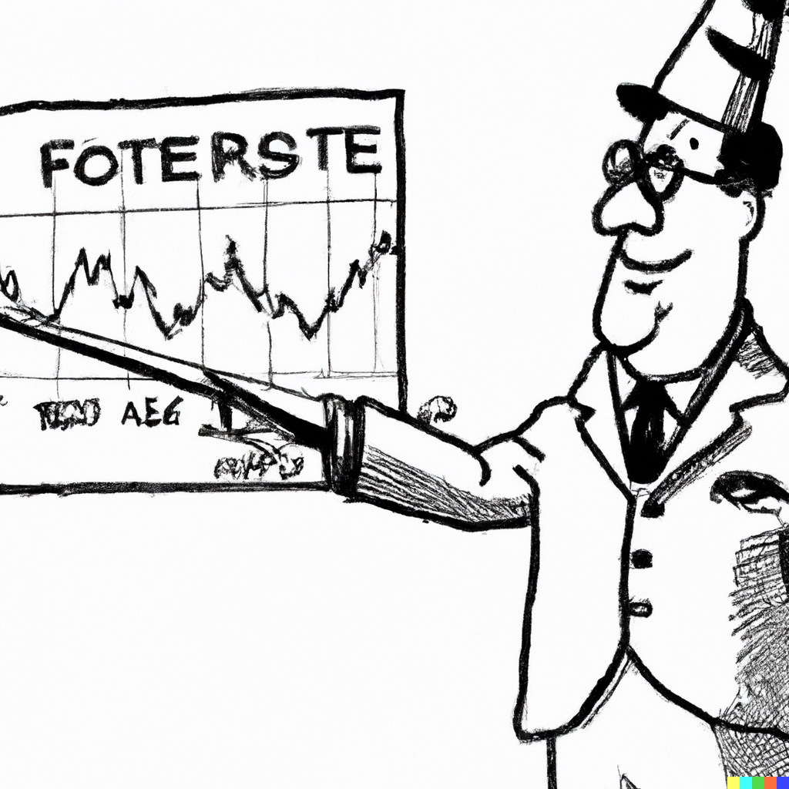

# &ndash; Autoregression


```{r echo=FALSE, include=FALSE, message=FALSE}
library(ggplot2)
library(data.table)
library(urca)
library(forecast)
library(cowplot)
```
## Stochastic Cycles

`r newthought('Often there is')` a cyclical pattern in economic time series. Cycles are characterized by a sequence of expansions and contractions, almost like in the case of seasonality. Unlike seasonality, however, a cycle is not contained within a calendar year and, moreover, the amplitude and length of cycles may vary from one another. Such cycles, which are (assumed to be) generated by random variables, are referred to as *stochastic cycles*.

Autoregressive stochastic cycle is a special and widely applied case of a stochastic cycle, where a random variable in a given period of a stochastic process is expressed as a function of random variables, of the same stochastic process, from preceding periods. That is:
$$Y_t = f(Y_{t-1},Y_{t-2},\ldots),\;~~t=1,\ldots,T.$$ Autoregressive models, or simply *autoregressions* are deployed to approximate dynamics of such stochastic cycles.


## Modeling

An autoregression of order $p$, denoted as $AR(p)$, has the following functional form:
$$y_t = \alpha + \beta_1 y_{t-1}+\beta_2 y_{t-2}+ \cdots + \beta_p y_{t-p}+\varepsilon_t,$$ where $\varepsilon\sim iid~\text{N}\left(0,\sigma^2_{\varepsilon}\right)$

The sum of the autoregressive parameters, $\beta_1,\ldots,\beta_p$, depicts the persistence of the series. The larger is the persistence (i.e., closer it is to one), the longer it takes for the effect of a shock to dissolve. The effect will, eventually, dissolve so long as the series are covariance-stationary. 

The autocorrelation, $\rho$, and partial autocorrelation, $\pi$, functions of the covariance-stationary $AR(p)$ process have the following distinctive features:

- $\rho_1 = \pi_1$, and $\pi_p = \beta_p$.
- The values of $\beta_1,\ldots,\beta_p$ determine the shape of the autocorrelation function (ACF); in any case, the smaller (in absolute terms) is the persistence measure, the faster the ACF decays toward zero.
- The partial autocorrelation function (PACF) is characterized by "statistically significant" first $p$ spikes $\pi_1 \neq 0,\ldots,\pi_p \neq 0$, and the remaining $\pi_k = 0$, $\forall k > p$.

In what follows, we consider the cases of the first-order autoregression as an illustration.


### First-order autoregression

A first-order autoregression is given by: $$y_t = \alpha + \beta_1 y_{t-1} + \varepsilon_t,$$ where $\alpha$ is a constant term; $\beta_1$ is the *persistence* parameter; and $\varepsilon_t$ is a white noise process.

A necessary and sufficient condition for an $AR(1)$ process to be covariance stationary is that $|\beta_1| < 1$. We can see this by substituting recursively the lagged equations into the lagged dependent variables:
$$
\begin{aligned}
y_t &= \alpha + \beta_1 y_{t-1} + \varepsilon_t \notag \\
y_t &= \alpha + \beta_1 (\alpha + \beta_1 y_{t-2} + \varepsilon_{t-1}) + \varepsilon_t \notag \\
&= \alpha(1+\beta_1) + \beta_1^2 (\alpha + \beta_1 y_{t-3} + \varepsilon_{t-2}) + \beta_1\varepsilon_{t-1} + \varepsilon_t \notag \\
&\vdots  \notag \\
&= \alpha\sum_{i=0}^{k-1}\beta_1^i + \beta_1^k y_{t-k} + \sum_{i=0}^{k-1}\beta_1^i\varepsilon_{t-i}
\end{aligned}
$$
The end-result is a general linear process with geometrically declining coefficients. Here, $|\beta_1| < 1$ is required for convergence.

Assuming $|\beta_1| < 1$, as $k \to \infty$ the process converges to: $$y_t = \frac{\alpha}{1-\beta_1} + \sum_{i=0}^{\infty}\beta_1^i\varepsilon_{t-i}$$

The *unconditional mean* of this process is: $$\mu = E\left(y_t\right) = E\left(\frac{\alpha}{1-\beta_1} + \sum_{i=0}^{\infty}\beta_1^i\varepsilon_{t-i}\right) = \frac{\alpha}{1-\beta_1}$$

The *unconditional variance* of this process is: $$\gamma_0 = Var\left(y_t\right) = Var\left(\frac{\alpha}{1-\beta_1} + \sum_{i=0}^{\infty}\beta_1^i\varepsilon_{t-i}\right) = \frac{\sigma_{\varepsilon}^2}{1-\beta_1^2}$$

The *Autocovariance* is simply the covariance between $y_t$ and $y_{t-k}$, that is: $$\gamma_k = Cov(y_t,y_{t-k}) = E[(y_t - \mu)(y_{t-k} - \mu)] = E(y_t y_{t-k}) - \mu^2$$

Some algebraic manipulation can help us show that: $$\gamma_k = \beta_1\gamma_{k-1},$$ and that: $$\rho_{k} = \beta_1\rho_{k-1}$$ (recall, $\rho_k = \gamma_k/\gamma_0$ is the autocorrelation coefficient).

In fact, for AR(1), an autocorrelation coefficient of some lag can be represented as the autoregression parameter (which in this instance is equivalent to the persistence measure) to that power. That is:
$$
\begin{aligned}
\rho_1 &= \beta_1\rho_0 = \beta_1 \notag \\
\rho_2 &= \beta_1\rho_1 = \beta_1^2 \notag \\
&\vdots \notag \\
\rho_k &= \beta_1\rho_{k-1} = \beta_1^k
\end{aligned}
$$

It follows that the autocorrelation function of a covariance stationary AR(1) is a geometric decay; the smaller is $|\beta_1|$ the more rapid is the decay.

Moreover, a smaller persistence parameter results in a quicker adjustment to the *unconditional mean* of the process.


### Unit Roots and Non-stationarity

A special case of an AR(1) process is a random walk with drift. The latter is obtained by setting $\beta_1=1$. Note that the unconditional mean and variance are undefined under this restriction. 

We cannot directly test the null of non-stationarity in an autoregression. That is, we cannot just estimate: $$y_t = \alpha+\beta_1 y_{t-1}+\varepsilon_t$$ and test whether $\hat{\beta}_1$ is statistically significantly less than unity.

Instead, we can subtract $y_{t-1}$ from both sides of the equation, and estimate: $$\Delta y_t = \alpha+\phi y_{t-1}+\varepsilon_t,$$ where $\phi=\beta_1-1$, and test whether $\hat{\phi}$ is statistically significantly less than zero. This test is known as the Dickey-Fuller (DF) test.

In practice, we apply the augmented Dickey-Fuller (ADF) test, which is the same test as above, except the lags of the dependent variable, $\Delta y_t$, are added to the regression to ensure that $\varepsilon_t$ is white noise.

It is important to note that distribution of the test statistic is non-standard. That is, we can not use t distribution to test the null hypothesis of non-stationarity after obtaining the test statistic associated with $\hat{\phi}$. Instead, we use the relevant version of the Dickey-Fuller table.^[The three versions of the test are (i) unit root, (ii) unit root with drift, and (iii) unit root with drift and trend.] 

To illustrate some of the foregoing, consider the USD/EUR exchange rates.

```{r, exchange, fig.cap="USD/EUR exchange rates", echo=FALSE, message=FALSE}
load("../../Books/forecasting/data/exchange_rates.RData")

ggplot(exchange_rates,aes(x=date,y=y))+
  geom_line(color="powderblue",size=.8)+
  labs(x="Year",y="Exchange Rate (USD/EUR)",caption="retrieved from FRED, Federal Reserve Bank of St. Louis\nhttps://fred.stlouisfed.org/series/EXUSEU")+
  theme_classic()+
  theme(axis.title = element_text(size=14),axis.text = element_text(size=12))
```

First, let's observe the autocorrelation and partial autocorrelation functions of the series.

```{r, acfexchange, fig.cap="Autocorrelation function", echo=FALSE, message=FALSE}
maxlag <- 12
dt <- data.table(k=c(1:maxlag),rho=c(acf(exchange_rates$y,plot=F)[1:maxlag]$acf))

ggplot(dt,aes(x=k,y=rho))+
  geom_segment(aes(xend=k,yend=0),color="powderblue",size=1.2)+
  geom_hline(yintercept=0,size=.8)+
  geom_hline(yintercept=c(-1.96/sqrt(nrow(exchange_rates)),1.96/sqrt(nrow(exchange_rates))),size=.5,linetype=5,col="coral")+
  scale_x_continuous(breaks=c(1:maxlag),labels=c(1:maxlag))+
  labs(x="k",y=expression(rho[k]))+
  coord_cartesian(ylim=c(-1,1))+
  theme_classic()+
  theme(axis.title = element_text(size=14),axis.text = element_text(size=12))
```

```{r, pacfexchange, fig.cap="Partial autocorrelation function", echo=FALSE, message=FALSE}
maxlag <- 12
dt <- data.table(k=c(1:maxlag),rho=c(pacf(exchange_rates$y,plot=F)[1:maxlag]$acf))

ggplot(dt,aes(x=k,y=rho))+
  geom_segment(aes(xend=k,yend=0),color="powderblue",size=1.2)+
  geom_hline(yintercept=0,size=.8)+
  geom_hline(yintercept=c(-1.96/sqrt(nrow(exchange_rates)),1.96/sqrt(nrow(exchange_rates))),size=.5,linetype=5,col="coral")+
  scale_x_continuous(breaks=c(1:maxlag),labels=c(1:maxlag))+
  labs(x="k",y=expression(rho[k]))+
  coord_cartesian(ylim=c(-1,1))+
  theme_classic()+
  theme(axis.title = element_text(size=22),axis.text = element_text(size=18))
```

That autocorrelations decrease gradually and eventually become statistically indistinguishable from zero is suggestive of a stationary process. That partial autocorrelations of the first two lags are statistically significantly different from zero is suggestive of the second-order autoregression.^[More formally, the order of autoregression can be determined using an information criterion such as AIC or SIC.]

```{r echo=FALSE, message=FALSE, cache=TRUE}
exchange_rates[,`:=`(y1=shift(y,1),y2=shift(y,2))]
exchange_rates[,`:=`(dy=y-y1,dy1=y1-y2)]
adf <- lm(dy~y1+dy1,data=exchange_rates)
adf_t <- summary(adf)$coefficients[2,3]
adf_test <- ur.df(exchange_rates$y,type="drift",lags=1)@teststat
adf_crit <- ur.df(exchange_rates$y,type="drift",lags=1)@cval
```

Let's check formally, using augmented Dickey-Fuller test, whether the series are non-stationary. For that, estimate $\Delta y_t=\alpha+\phi y_{t-1}+\delta_1\Delta y_{t-1}+\varepsilon_t$, and obtain test statistics associated with $\hat{\phi}$. The test statistic turns out to be `r round(adf_t,3)` which lies between the critical values of `r round(adf_crit[1,2],3)` for 5% statistical significance and `r round(adf_crit[1,3],3)` for 10% statistical significance.


## Forecasting

Making forecasts for some future period, $t+h$, from an AR(p) model that has been fit to the data up to and including period $t+h-1$ can be a straightforward exercise, so long as we have access to such data. That is the case for one-step-ahead forecasts, that is when $h=1$, for which the information set is readily available. For multi-step-ahead forecasts, that is when $h>1$, this no longer it the case. There are two approaches or methods of multi-step-ahead forecasting that can allowe us to circumvent the issue.

### Iterative Method of Multistep Forecasting

One approach involves 'coming up' with the value of the variable that has not been realized yet. For example, when making a two-step-ahead forecast for period $t+2$, we need data from period $t+1$, which is not available at the time when the forecast is made. Instead, we need to use our forecast for period $t+1$. The same applies to forecasts for any subsequent periods in the future. This approach is known as an *iterative* method of forecasting, wherein we make forecast for some period using the available data, then iterate forward by one period and use the most recent forecast to make the next period's forecast, and so on and so forth.

Consider an AR(p) model. A future realization of the random variable is $$y_{t+h} = \alpha + \beta_1 y_{t+h-1} + \cdots  + \beta_p y_{t+h-p}+\varepsilon_{t+h}$$ 

Point forecast (ignoring parameter uncertainty) is: $$y_{t+h|t} = E(y_{t+h}|\Omega_t) = \alpha + \beta_1 y_{t+h-1|t} + \cdots  + \beta_p y_{t+h-p|t},$$ where $y_{t+h-j|t}=y_{t+h-j}$ when $h-j\le 0$. That is, for a given time period, we use the realization of the random variable if it is observed, otherwise we use the point forecast of the realization.

Forecast error: $$e_{t+h|t} = y_{t+h} - y_{t+h|t} = \beta_1 e_{t+h-1|t} + \cdots  + \beta_p e_{t+h-p|t} + \varepsilon_{t+h},$$ where $e_{t+h-j|t}=0$ when $h-j\le 0$. So, when $h=1$, $e_{t+1|t}=\varepsilon_{t+1}$, which is the same as with previously described models (e.g., trend or seasonal models), but when $h>1$, forecast error becomes more complex.

The forecast variance: $$\sigma_{t+h|t}^2 = \sigma_{\varepsilon}^2 + \sum_{i=1}^{p}\beta_i^2 Var(e_{t+h-i|t}) + 2\sum_{i \neq j}\beta_i\beta_j Cov(e_{t+h-i|t},e_{t+h-j|t})$$
These variance and covariances of forecast errors from preceding horizons are some functions of the in-sample error variance and model parameters.

The 95% interval forecast is: $$y_{t+h|t} \pm 1.96 \hat{\sigma}_{\varepsilon}.$$

To illustrate the foregoing, let's revisit the USD/EUR exchange rate series, and obtain point and interval forecasts for periods from January 2011 onward based on parameter estimates of the second-order autoregression using data up to and including December 2010.

```{r, forexchange, fig.cap="Second-order autoregression", echo=FALSE, message=FALSE}
y <- exchange_rates[date<=as.Date("2010-12-31")]$y
ar2 <- ar(y,order.max=2,demean=F,intercept=T,method="ols")

ar2f <- forecast(ar2,h=length(exchange_rates[date>as.Date("2010-12-31")]$y),level=95)

exchange_rates$f <- c(rep(NA,length(exchange_rates[date<=as.Date("2010-12-31")]$y)),as.matrix(ar2f$mean))
exchange_rates$l <- c(rep(NA,length(exchange_rates[date<=as.Date("2010-12-31")]$y)),as.matrix(ar2f$lower))
exchange_rates$u <- c(rep(NA,length(exchange_rates[date<=as.Date("2010-12-31")]$y)),as.matrix(ar2f$upper))

ggplot(exchange_rates,aes(x=date,y=y))+
  geom_ribbon(aes(ymin=l,ymax=u),fill="coral",alpha=.2)+
  geom_line(color="powderblue",size=.8)+
  geom_line(data=exchange_rates[date>as.Date("2010-12-31")],color="gray",size=.8)+
  geom_line(aes(y=f),color="coral",size=.8,linetype=5,na.rm=T)+
  labs(x="Year",y="Exchange Rate (USD/EUR)",caption="retrieved from FRED, Federal Reserve Bank of St. Louis\nhttps://fred.stlouisfed.org/series/EXUSEU")+
  theme_classic()+
  theme(axis.title = element_text(size=22),axis.text = element_text(size=18))
```

### Direct Method of Multistep Forecasting

The other approach entails directly obtaining multi-step-ahead forecasts. To illustrate, consider a first-order autoregression: $y_t=\alpha+\beta_1 y_{t-1}+\varepsilon_t.$ 

One-step-ahead point forecast is readily given by: $y_{t+1|t}=\alpha+\beta_1 y_{t}$. That is, we observe all the variables on the right-hand side of the equation. 

To generate the two-step-ahead forecast in a similar manner, that is by ensuring the observed variables on the right-hand side of the equation, we can substitute $y_{t-1}=\alpha+\beta_1 y_{t-2}+\varepsilon_{t-1}$ into the original equation to obtain: $$y_t=\alpha(1+\beta_1)+\beta_1^2y_{t-2} + \varepsilon_t + \beta_1\varepsilon_{t-1} = \tilde{\alpha} + \tilde{\beta}_1 y_{t-2} + u_t,$$ where $\tilde{\alpha}=\alpha(1+\beta_1)$ and $\tilde{\beta}_1=\beta_1^2$, and $u_t=\varepsilon_t + \beta_1\varepsilon_{t-1}.$

Thus, we can obtain two-step-ahead forecast in a manner similar to that when we obtain one-step-ahead forecast by regressing $y_t$ on $y_{t-2}$, and then directly forecasting $y_{t+2}$ from $y_{t}$. 

This *direct* method of multi-step-ahead forecasting can be extended to higher order autoregression, as well as to any forecast horizon.

In the direct method, error terms are serially correlated (by construction).^[Recall that multi-step-ahead forecast errors tend to be serially correlated. So, direct method merely maintains this feature of multistep forecasts.] For example, in the direct two-step-ahead forecast from a re-specified AR(1) model, as we saw: $u_t = \varepsilon_t+\beta_1\varepsilon_{t-1}$. It then follows that: $$\sigma^2_u = E\left[(\varepsilon_t+\beta_1\varepsilon_{t-1})^2\right] = \sigma^2_{\varepsilon}(1+\beta_1^2).$$

This is also the expression of the two-step-ahead forecast error variance under the iterated method.

Thus, when applying the direct method of forecasting, interval forecasts for a given horizon are obtained 'directly,' based on the standard deviation of the residuals.

The relative performance of forecasts from the considered two methods&mdash;iterative and direct&mdash;in terms of bias and efficiency depends on the bias and efficiency of the estimators of each method. 

Assuming the autoregressive model is correctly specified, both methods are consistent, but the iterative method is more efficient. Thus, in large samples, the iterative forecast can be expected to perform better than the direct forecast.

In the case of a mis-specified model, however, the direct method may as well outperform the iterated method. 


