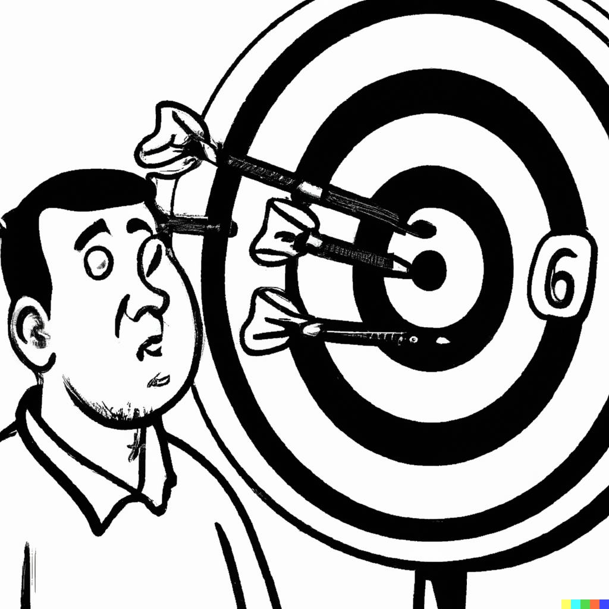

# &ndash; Forecast Combination


```{r echo=FALSE, include=FALSE, message=FALSE}
library(ggplot2)
library(data.table)
```

`r newthought('Each model yields inaccurate forecasts')` in each own way. Taken together, several models can contribute to an accurate forecast, on average. As the joke goes: A mathematician, a physicist, and a statistician went hunting. They stumbled upon a deer. The mathematician fired first but missed the target to the left by a few inches. The physicist gave a shot next and missed the mark to the right by a few inches. Having observed this, the statistician exclaimed “We got him!”