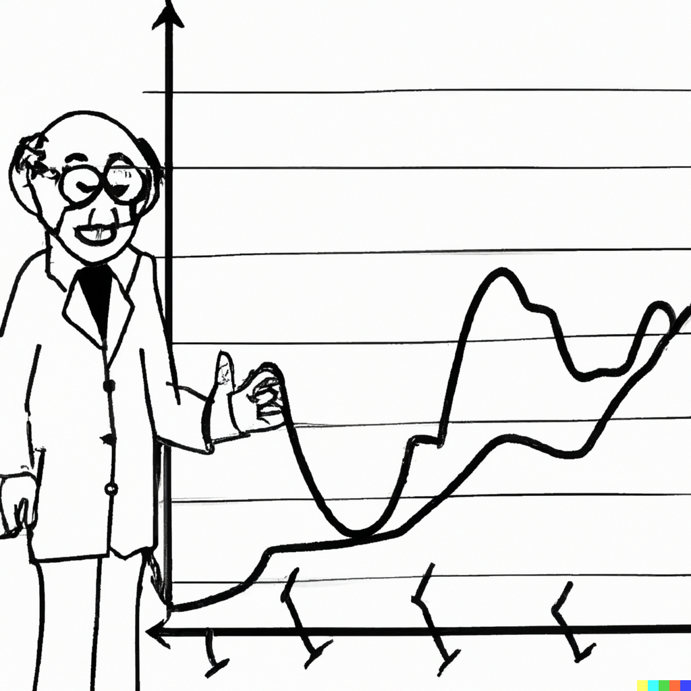

# &ndash; Threshold Autoregression


```{r echo=FALSE, include=FALSE, message=FALSE}
library(ggplot2)
library(data.table)
```

## Regime-Dependent Nonlinearity

`r newthought('A linear model is a crude approximation')` of a true model. It may very well be possible that a nonlinear model offers a better fit to the data. Nonlinear models come in many flavours. Here we will consider a specific type of nonlinear models that belongs to the family of *regime-dependent* models.

A regime-dependent model can be seen as a combination of linear specifications that are linked to each other in some (nonlinear) way. To that end, such nonlinear models are also referred to as the piece-wise linear models&mdash;i.e., each piece, or segment, of the model is linear, but when taken together we have a nonlinear model at hand. 

Here, we will consider two representative regime-dependent models: a time-varying threshold autoregression (TVAR) and a self-exciting threshold autoregression (SETAR). In both instances, we will assume that the switch between the regimes happens based on some threshold variable, and that it happens instantaneously.^[There are other members of the family of regime-dependent models, e.g., a smooth transition autregression (STAR), which relax this assumption of an instantaneous switch between the regimes.]


## Modeling

Consider an AR(p) process with a deterministic trend: $$y_t = \alpha_0 + \alpha_1 t + \sum_{i=1}^{p}\beta_i y_{t-i} + \varepsilon_t,$$ where $\alpha_0 + \alpha_1 t$ is the time-specific deterministic component.

This specification assumes a linear trend, but that doesn't need to be the case. We can have quadratic or cubic trends, for example, or we can have no trend component at all.

A simple augmentation of the foregoing model is an autoregressive model with a switching trend component: $$y_t = \delta_{0} + \delta_{1} t + \delta_{2}(t-\tau)I(t>\tau) + \beta y_{t-1} + \varepsilon_t,$$ where $\tau$ is the threshold parameter.

Such switch can be extended to the whole autoregression. For example, a two-regime AR(p) with drift can be given by: $$y_t = \delta_0 + \delta_1 t + \sum_{i=1}^{p}\beta_{1i} y_{t-i} + \left[\delta_2(t-\tau) + \sum_{i=1}^{p}\beta_{2i} y_{t-i}\right]I(t>\tau) + \varepsilon_t.$$ This equation implies that not only the trend, but also the autoregressive dynamics change around $\tau$.

The foregoing nonlinear specifications assumes that the switch in the model occurs at some point in time, i.e. the regime-switching variable is a function of time. But the regime-switching variable can also be a function of the dependent variable or, indeed, any other (exogenous) variable: $$y_t = \alpha_0 + \sum_{i=1}^{p}\beta_{0i} y_{t-i} + \left(\alpha_1 + \sum_{i=1}^{p}\beta_{1i} y_{t-i}\right)I(s_t>\kappa) + \varepsilon_t,$$ where $s_t$ is the regime-switching variable, and $\kappa$ is the threshold, such that $\underline{s}_t < \kappa < \overline{s}_t$, where $\underline{s}_t$ and $\overline{s}_t$ are the lower and upper quantiles of the regime-switching variable.^[Such restriction is usually needed to ensure that there are enough observations in each of the regimes of the model.]

This equation is referred to as a threshold autoregression, or TAR(p). More specifically, if in a TAR(p), $s_t = y_{t-d}$, $d = 1,\ldots,m$, then it is a self-exciting threshold autoregression, or SETAR(p); alternatively, if $s_t = \Delta y_{t-d}$, $d = 1,\ldots,m$, then the model is referred to as a *momentum* threshold autoregression, or momentum-TAR(p). The latter is typically applied when $y_t$ is an I(1) process.

A TAR (any version of it) can take a multiple-regime form: $$y_t = \alpha_1 + \sum_{i=1}^{p}\beta_{1i} y_{t-i} + \sum_{j=2}^{K}{\left(\alpha_j + \sum_{i=1}^{p}\beta_{ji} y_{t-i}\right)I(s_t>\kappa_j)} + \varepsilon_t,$$ where $K$ depicts the number of regimes in the equation.

When estimating TAR-type models, we usually have no *a priori* knowledge on the number of regimes, the autoregressive order in each regime, the regime-switching (or threshold) variable, and the value(s) of the threshold parameter(s). 

Joint estimation of model parameters requires some nonlinear optimization routine. Alternatively, we can approximate such optimization using a grid-search procedure. The procedure relies on the fact that once the threshold parameter is known, the model reduces to a linear model, and the least squares estimator can be applied then. That is, for example, $$\hat{\tau} = \arg\min_{\tau}\hat{\sigma}^2(\tau),$$ where $$\hat{\sigma}^2(\tau) = \frac{1}{T-k}\sum_{t=1}^{T}\hat{\varepsilon}_t^2(\tau)$$ for all candidate values of $\tau$. The candidate values of $\tau$ typically belong to a range between the lower and upper quantiles of the transition variable, which is simply the trend in the case of the time-varying TAR, and the lagged dependent variable in the case of the self-exciting TAR.


## Forecasting

In the case of time-varying shifting trend (mean) models, the most recent trend component is used to obtain forecasts. To that end, the forecasting routine is similar to that of linear trend models.

In the case of regime-switching models (e.g., TAR), obtaining one-step-ahead forecasts is a straightforward exercise: 
$$\begin{aligned}
y_{t+1|t} &= \alpha_0+\beta_{01}y_{t}+\beta_{02}y_{t-1}+\ldots \\
          &+ (\alpha_1+\beta_{11}y_{t}+\beta_{12}y_{t-1}+\ldots)I(s_t>c)
\end{aligned}$$

Obtaining h-step-ahead forecasts (where $h>1$) is less trivial, however. Of the available options:

- The iterated method (or, the so-called skeleton extrapolation) is an easy but an inefficient option. 
- The analytical method can be unbearably tedious.
- A numerical method is usually applicable and, moreover, it addresses the caveats of the previous two options.


### Skeleton Extrapolation

One-step-ahead forecast: $$y_{t+1|t} = E(y_{t+1}|\Omega_{t}) = g(y_{t},y_{t-1},\ldots,y_{t+1-p};\theta)$$

Two-step-ahead forecast: $$y_{t+2|t} = E(y_{t+2}|\Omega_{t}) = g(y_{t+1|t},y_{t},\ldots,y_{t+2-p};\theta)$$

h-step-ahead forecast: $$y_{t+h|t} = E(y_{t+h}|\Omega_{t}) = g(y_{t+h-1|t},y_{t+h-2|t},\ldots,y_{t+h-p|t};\theta)$$

This is fine for linear models; but not okay for nonlinear models.


### Analytical Method

One-step-ahead forecast is the same as before (no uncertainty about the observed data).

Two-step-ahead forecast is: $$\tilde{y}_{t+2|t} = \int_{-\infty}^{\infty}g(y_{t+1|t}+\varepsilon_{t+1},y_{t},\ldots,y_{t+2-p};\theta)f(\varepsilon_{t+1})d\varepsilon_{t+1}$$

Unless the model is linear, $\tilde{y}_{t+2|t} \ne y_{t+2|t}$.

Longer horizon forecasts require multiple integrals.


### Numerical Method: Bootstrap Resampling

Bootstrap resampling helps approximate the optimal forecast from nonlinear models and circumvents the complexity of integration.

Algorithm:

1. Estimate the (nonlinear) time series model and store the residuals.
2. From this set of residuals, sample (with replacement) a vector of shocks for a bootstrap iteration, $\varepsilon^b = (\varepsilon_{t+1}^b,\varepsilon_{t+2}^b,\ldots,\varepsilon_{t+h}^b)'$.
3. Use this sample of shocks, along with the estimated parameters and historical observations, to iteratively generate a forecast path for the given bootstrap iteration.
4. Repeat steps 2-3 many times to generate an empirical distribution of forecast paths.
5. Take the simple averages, for each horizon, across all bootstrap iterations to generate point forecasts.

To better illustrate the algorithm, consider a $\text{SETAR}(p,y_{t-1})$ model, that is, a SETAR(p) with $y_{t-1}$ as the regime-switching variable.

One-step-ahead bootstrap forecast: 
$$\begin{aligned}
y_{t+1|t}^b &= (\alpha_1 + \beta_{11} y_{t} + \ldots + \beta_{1p} y_{t+1-p})I(y_{t} \leq \kappa) \\ 
                &+ (\alpha_2 + \beta_{21} y_{t} + \ldots + \beta_{2p} y_{t+1-p})I(y_{t} > \kappa)+\varepsilon_{t+1}^b
\end{aligned}$$ Note that when $I(y_{t} \leq \kappa)=1$ then $I(y_{t} > \kappa)=0$, and vice versa. So, either the parameters $\{\alpha_1,\beta_{11},\ldots,\beta_{1p}\}$ or the parameters $\{\alpha_2,\beta_{21},\ldots,\beta_{2p}\}$ are used to generate the one-step-ahead fitted value, which is then 'disturbed' by the bootstrap error term, $\varepsilon_{t+1}^b$, thus resulting in the one-step-ahead bootstrap forecast.

Two-step-ahead bootstrap forecast: 
$$\begin{aligned}
y_{t+2|t}^b &= (\alpha_1 + \beta_{11} y_{t+1|t}^b + \ldots + \beta_{1p} y_{t+2-p})I(y_{t+1|t}^b \leq \kappa) \\
                &+ (\alpha_2 + \beta_{21} y_{t+1|t}^b + \ldots + \beta_{2p} y_{t+2-p})I(y_{t+1|t}^b > \kappa)+\varepsilon_{t+2}^b
\end{aligned}$$ The mechanism here is similar to that described above for the one-step-ahead bootstrap forecast. The key difference is in the regime-switching variable, which in this case is $y_{t+1|t}^b$, which is a function of the boostrap error term. The sign and size of this error term can, in and of itself, have a regime-switching effect. That is, in different bootstrap iterations, the boostrap error term can determine whether the parameters $\{\alpha_1,\beta_{11},\ldots,\beta_{1p}\}$ or the parameters $\{\alpha_2,\beta_{21},\ldots,\beta_{2p}\}$ are used to generate two-step-ahead bootstrap forecast.

In general, the aforementioned peculiarity illustrated with the two-step-ahead bootstrap forecast is relevant to any $h$-step-ahead forecast, so long as $h>d$, where $d$ is the delay factor of the regime-switching variable, $y_{t-d}$. 


Point forecast at horizon $h$ is: $$\bar{y}_{t+h|t} = B^{-1}\sum_{b=1}^{B}y_{t+h|t}^b,$$ where $B$ is the total number of bootstrap iterations (usually many thousands of iterations).

Forecast error at horizon $h$ is: $$e_{t+h|t}=y_{t+h}-\bar{y}_{t+h|t}.$$ Measures of forecast accuracy measures (such as RMSFE, for example) can be obtained based on this forecast error.

For interval forecasts, we will need to resort to the relevant percentiles of the empirical distribution of the bootstrapped forecast paths. This is because the multi-step forecast density from nonlinear models, usually, is no longer symmetric or normally distributed. Indeed, multi-step forecast densities from regine-dependent models, such as SETAR, usually are characterized by multiple modes (instead of a single mode). 
