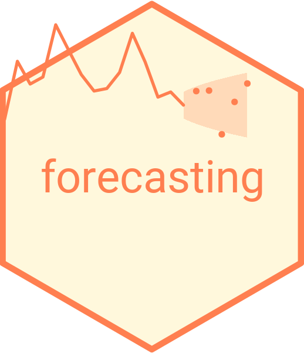

# Time Series Modeling and Forecasting 

## Current Chapters

The chapters are organized in four parts: *Preliminaries*---chapters 1-3, *Deterministic Models*---chapters 4-5, *Autoregressive Models*---chapters 6-8, and *Forecast Evaluation*--chapters 9-10. 

1. Introduction to Forecasting
2. Stochastic Process and Time Series
3. Basics of Forecasting
4. Trends
5. Seasonality
6. Linear Autoregression
7. Vector Autoregression
8. Threshold Autoregression
9. Forecast Evaluation
10. Forecast Combination

## Planned Changes

The chapters will be organized as follows: 

I.    Preliminaries
      1. Introduction to Forecasting
      2. Stochastic Process and Time Series
      3. Forecast Evaluation
II.   Trends and Seasonality
      4. Trends
      5. Seasonality
III.  Dynamic Models
      6. Linear Autoregression
      7. Vector Autoregression
      8. Threshold Autoregression
IV.   Forecast Inference
      9. Forecast Assessment
      10. Forecast Combination
 

