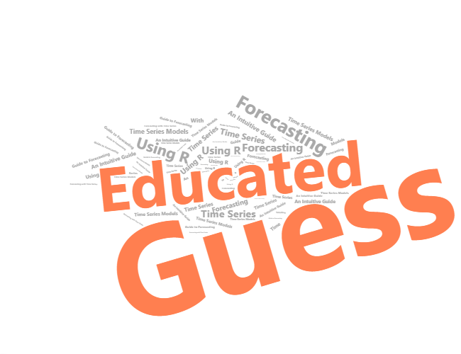

--- 
title: "Educated Guess" 
subtitle: "An Intuitive Guide to Forecasting With Time Series Models Using R"
author: "David Ubilava"
date: "`r format(Sys.Date(),'%B %Y')`"
description: "Forecasting With Time Series Models Using R"
documentclass: book
classoption: oneside
site: bookdown::bookdown_site
knit: bookdown::preview_chapter
always_allow_html: yes
link-citations: yes
bibliography: ["book.bib"]
biblio-style: apalike
cover-image: forecasting-logo.png
fontsize: 12pt
---


```{r, include=FALSE, eval=TRUE}
knitr::opts_chunk$set(eval=TRUE, echo=FALSE, cache=TRUE, message=FALSE, warning=FALSE, fig.width=6.5, fig.height=4.0)
library(ggplot2)
library(data.table)
library(tufte)
# library(msmbstyle)
```

# {-}
<!-- # An Intuitive Guide to Forecasting With Time Series Models Using R {-} -->



'The future will be the child of the past and the present, even if a rebellious child.' This quote belongs to *George Crumb*&mdash;an American composer of classical music. I don’t listen to classical music, and I had not heard of George Crumb until when I searched for a quote by *Ilia Chavchavadze*&mdash;a Georgian public figure of the late 19th and early 20th centuries&mdash;who said: 'The present born from the past is a parent of the future.'

Neither George Crumb nor Ilia Chavchavadze was an expert in forecasting or in time series analysis. But in their quotes, they both described rather eloquently the very essence of forecasting: We can make an educated guess about the future because we observe and take lessons from the past.

A diverse set of forecasting methods typically rely on insights from econometric analysis of time series. In time series analysis, the implied assumption is that the past tends to repeat itself, at least to some extent. So, if we well study the past, we may be able to forecast an event with some degree of accuracy. 

This book is about econometric models that help us learn the past to predict the future. It aims to serve as a primer for econometric time series analysis and forecasting. The book consists of two parts. The first part introduces econometric models and methods for forecasting. This part helps develop intuition behind time series modeling and forecasting. The second part presents tutorials that complement the material from the first part. The tutorials help with hands-on experience in coding in R to forecast time series data. 


